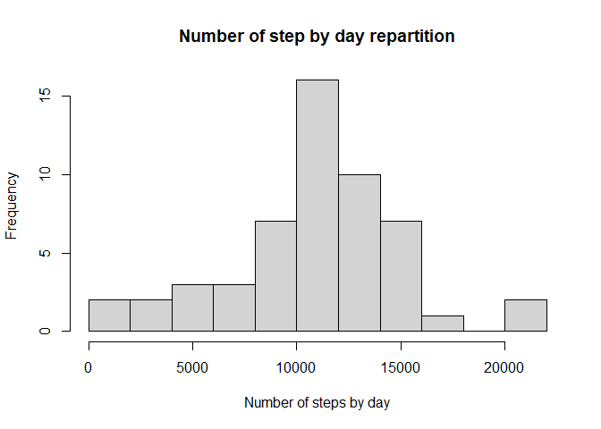
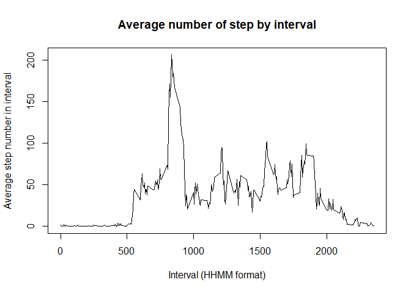
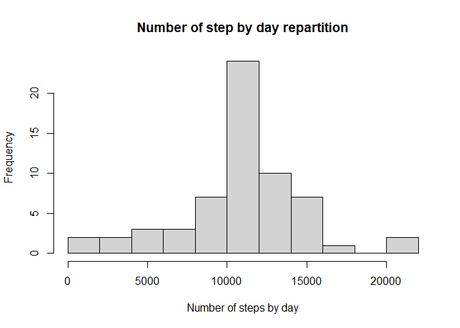
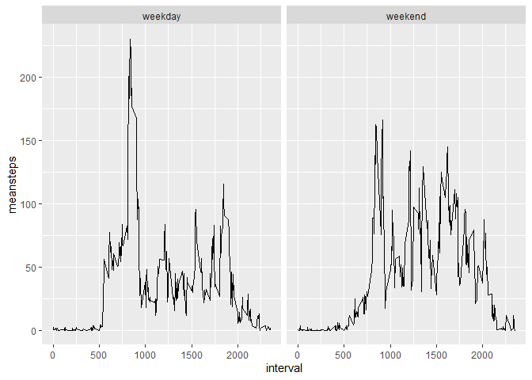

## introduction
ggplot2 library will be used further to build graphics


```r
library(ggplot2)
```
## Loading and preprocessing the data 
Data is unziped and then loaded (can take a while given the dataset size)

```r
unzip("activity.zip")
my_data <- read.csv("activity.csv")
```

## What is mean total number of steps taken per day?
Data is aggregated based on the date. Step number is summed

```r
stepbyday <- aggregate(my_data$steps, list(my_data$date), sum)
names(stepbyday) <- c("day", "steps")

hist(stepbyday$steps, breaks=10, xlab="Number of steps by day", main="Number of step by day repartition")
```

<!-- -->

  
Average (mean) number of steps by day:

```r
mean(stepbyday$steps, na.rm=TRUE)
```

```
## [1] 10766.19
```

Median number of steps by day:

```r
median(stepbyday$steps, na.rm=TRUE)
```

```
## [1] 10765
```


## What is the average daily activity pattern?
Data is aggregated based on the interval. Step number is averaged


```r
stepbyinterval <- aggregate(my_data$steps, list(my_data$interval), mean, na.rm=TRUE)
names(stepbyinterval) <- c("interval", "meansteps")
```


Plot is built. Beware that the x-axis is surprising (using HHMM as unit instead of a real "time" format)

```r
plot(stepbyinterval$interval, stepbyinterval$meansteps, type="l", xlab="Interval (HHMM format)", ylab="Average step number in interval", main="Average number of step by interval")
```

<!-- -->

Identificaiton of the interval with most steps is done using which(max) function. It is displayed in a HHMM format:

```r
stepbyinterval$interval[which(stepbyinterval$meansteps == max(stepbyinterval$meansteps))]
```

```
## [1] 835
```

## Imputing missing values
Dataset is copied in a fully new variable as transformation will be performed:

```r
my_data2 <- my_data
```

Number of rows with NA:

```r
sum(is.na(my_data2$steps))
```

```
## [1] 2304
```

First, position of rows having NA is consolidated into a vector. Then a loop is made on each of these index to replace the NA value by the average value of the given interval (as calculated previously):


```r
naposition <- which(is.na(my_data2$steps))
for (i in naposition) {
  my_data2$steps[i] <- stepbyinterval$meansteps[match(my_data2$interval[i], stepbyinterval$interval)]

  }
```

After correction, check regarding how many NA are still present (must be 0):

```r
sum(is.na(my_data2$steps))
```

```
## [1] 0
```

As previously done, aggregation is made to calculate the average number of step by interval:

```r
stepbyday2 <- aggregate(my_data2$steps, list(my_data2$date), sum)
names(stepbyday2) <- c("day", "steps")
```

Newly aggregated data can then be plotted in an histogram:

```r
hist(stepbyday2$steps, breaks=10, xlab="Number of steps by day", main="Number of step by day repartition")
```

<!-- -->


Average (mean) number of steps by day:

```r
mean(stepbyday2$steps)
```

```
## [1] 10766.19
```

Median number of steps by day:

```r
median(stepbyday2$steps)
```

```
## [1] 10766.19
```

One can note than these values have only very slightly changed which was expected given values were replaced by mean values


## Are there differences in activity patterns between weekdays and weekends?
A new column is added based on the fact if the day is part of weekend or not. Note that given the way of working of the weekdays function, this is language dependent (only working on French-configured computer):


```r
my_data2$daytype[weekdays(as.Date(my_data2$date)) %in% c("samedi", "dimanche")] <- "weekend"
my_data2$daytype[is.na(my_data2$daytype)] <- "weekday"
my_data2$daytype <- as.factor(my_data2$daytype)
```

Data is then aggregated both on interval and daytype (weekend vs weekday):

```r
stepbyinterval2 <- aggregate(my_data2$steps, list(my_data2$interval, my_data2$daytype), mean, na.rm=TRUE)
names(stepbyinterval2) <- c("interval", "daytype", "meansteps")
```

ggplot2 is used to build the plot:

```r
g <- ggplot(stepbyinterval2, aes(x=interval, y = meansteps))
g + geom_line() + facet_grid(. ~daytype)
```

<!-- -->

One can see that during weekday, a very clear peak is visible around 8:30AM, most likely due to begining of work day. During week-end, one cannot see such peak.
